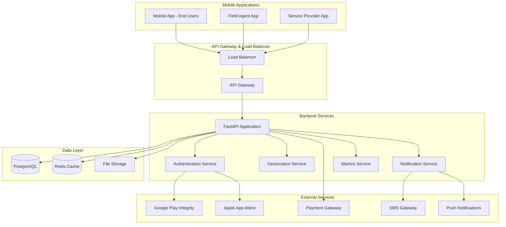

# Design Document

## Overview

The Panic System Platform is a comprehensive emergency response platform built with FastAPI and PostgreSQL, designed to connect security firms, emergency service providers, and end users through mobile applications. The system manages subscription-based emergency services with real-time coordination, geographical coverage validation, and performance monitoring.

## Architecture

### High-Level Architecture



### Technology Stack

- **Backend Framework**: FastAPI (Python)
- **Database**: PostgreSQL with PostGIS extension for geospatial data
- **Caching**: Redis for session management and frequently accessed data
- **Message Queue**: Redis with Celery for background tasks
- **Authentication**: JWT tokens with mobile app attestation
- **API Documentation**: FastAPI automatic OpenAPI/Swagger
- **Logging**: Structured logging with ELK Stack (Elasticsearch, Logstash, Kibana)
- **Monitoring**: Prometheus + Grafana for metrics and alerting
- **Tracing**: Jaeger for distributed tracing
- **File Storage**: AWS S3 or compatible object storage
- **Deployment**: Docker containers with Kubernetes orchestration

## Components and Interfaces

### Core API Modules

#### 1. Authentication & Authorization Module
```python
# Mobile app integrity verification
class AppAttestationService:
    async def verify_android_integrity(token: str) -> bool
    async def verify_ios_attestation(token: str) -> bool
    async def validate_request(request: Request) -> UserContext

# JWT token management with account protection
class AuthService:
    async def authenticate_user(credentials: UserCredentials) -> TokenPair
    async def refresh_token(refresh_token: str) -> AccessToken
    async def revoke_token(token: str) -> bool
    async def record_failed_login(user_identifier: str) -> int
    async def reset_failed_login_counter(user_identifier: str) -> bool
    async def is_account_locked(user_identifier: str) -> bool
    async def lock_account(user_identifier: str, duration_minutes: int = 30) -> bool

# Account security tracking
class AccountSecurityService:
    async def check_login_attempts(user_identifier: str) -> LoginAttemptStatus
    async def increment_failed_attempts(user_identifier: str) -> int
    async def reset_failed_attempts(user_identifier: str) -> bool
    async def get_lockout_duration(failed_attempts: int) -> int
    async def generate_unlock_otp(user_identifier: str) -> str
    async def verify_unlock_otp(user_identifier: str, otp: str) -> bool
    async def unlock_account_with_otp(user_identifier: str, otp: str) -> bool
    async def send_unlock_otp_sms(phone: str, otp: str) -> bool
    async def send_unlock_otp_email(email: str, otp: str) -> bool
```

#### 2. User Management Module
```python
class UserService:
    async def register_security_firm(firm_data: SecurityFirmRegistration) -> SecurityFirm
    async def register_user(user_data: UserRegistration) -> RegisteredUser
    async def verify_mobile_number(phone: str, verification_code: str) -> bool
    async def manage_user_groups(user_id: UUID, group_data: GroupData) -> Group

class SecurityFirmService:
    async def define_coverage_areas(firm_id: UUID, areas: List[CoverageArea]) -> bool
    async def manage_personnel(firm_id: UUID, personnel: PersonnelData) -> bool
    async def create_teams(firm_id: UUID, team_data: TeamData) -> Team
```

#### 3. Subscription Management Module
```python
class SubscriptionService:
    async def purchase_credits(firm_id: UUID, amount: int, payment_data: PaymentData) -> Transaction
    async def create_product(firm_id: UUID, product_data: ProductData) -> Product
    async def purchase_subscription(user_id: UUID, product_id: UUID) -> StoredSubscription
    async def apply_subscription(user_id: UUID, subscription_id: UUID, group_id: UUID) -> bool
    async def validate_subscription(group_id: UUID) -> SubscriptionStatus

class CreditService:
    async def deduct_credits(firm_id: UUID, amount: int) -> bool
    async def get_credit_balance(firm_id: UUID) -> int
    async def process_payment(payment_data: PaymentData) -> PaymentResult
```

#### 4. Emergency Request Module
```python
class EmergencyService:
    async def submit_panic_request(request_data: PanicRequest) -> RequestID
    async def validate_coverage(location: GPSCoordinates, firm_id: UUID) -> bool
    async def allocate_request(request_id: UUID, team_id: UUID) -> bool
    async def update_request_status(request_id: UUID, status: RequestStatus) -> bool
    async def complete_request(request_id: UUID, feedback: ServiceFeedback) -> bool
    async def validate_panic_request_authorization(phone: str, group_id: UUID) -> bool  # Works even if account locked

class GeolocationService:
    async def validate_location_in_coverage(location: GPSCoordinates, coverage_areas: List[CoverageArea]) -> bool
    async def find_nearest_service_providers(location: GPSCoordinates, service_type: ServiceType) -> List[ServiceProvider]
    async def calculate_eta(from_location: GPSCoordinates, to_location: GPSCoordinates) -> int
```

#### 5. Real-time Communication Module
```python
class NotificationService:
    async def send_push_notification(user_id: UUID, message: NotificationMessage) -> bool
    async def send_sms(phone: str, message: str) -> bool
    async def broadcast_to_team(team_id: UUID, message: TeamMessage) -> bool
    async def update_request_status_realtime(request_id: UUID, status: RequestStatus) -> bool

class WebSocketManager:
    async def connect_user(user_id: UUID, websocket: WebSocket) -> bool
    async def disconnect_user(user_id: UUID) -> bool
    async def send_realtime_update(user_id: UUID, update: RealtimeUpdate) -> bool
```

#### 6. Metrics and Analytics Module
```python
class MetricsService:
    async def record_response_time(request_id: UUID, timestamps: ResponseTimestamps) -> bool
    async def calculate_zone_metrics(firm_id: UUID, zone_id: UUID, service_type: ServiceType) -> ZoneMetrics
    async def generate_performance_report(firm_id: UUID, date_range: DateRange) -> PerformanceReport
    async def detect_performance_degradation(firm_id: UUID) -> List[Alert]

class PrankDetectionService:
    async def record_service_feedback(request_id: UUID, feedback: ServiceFeedback) -> bool
    async def flag_prank_request(request_id: UUID, user_id: UUID) -> bool
    async def calculate_user_fine(user_id: UUID) -> Fine
    async def process_fine_payment(fine_id: UUID, payment_data: PaymentData) -> bool
```

### Mobile API Endpoints

#### Authentication Endpoints
```
POST /api/mobile/auth/register
POST /api/mobile/auth/login
POST /api/mobile/auth/refresh
POST /api/mobile/auth/verify-phone
DELETE /api/mobile/auth/logout
POST /api/mobile/auth/request-unlock-otp
POST /api/mobile/auth/verify-unlock-otp
POST /api/mobile/auth/unlock-account
```

#### User Management Endpoints
```
GET /api/mobile/user/profile
PUT /api/mobile/user/profile
GET /api/mobile/user/groups
POST /api/mobile/user/groups
PUT /api/mobile/user/groups/{group_id}
DELETE /api/mobile/user/groups/{group_id}
```

#### Subscription Endpoints
```
GET /api/mobile/subscriptions/products
POST /api/mobile/subscriptions/purchase
GET /api/mobile/subscriptions/stored
POST /api/mobile/subscriptions/apply
GET /api/mobile/subscriptions/active
```

#### Emergency Request Endpoints
```
POST /api/mobile/emergency/request
GET /api/mobile/emergency/requests
PUT /api/mobile/emergency/requests/{request_id}/status
POST /api/mobile/emergency/requests/{request_id}/feedback
```

#### Field Agent Endpoints
```
GET /api/mobile/agent/requests/pending
PUT /api/mobile/agent/requests/{request_id}/accept
PUT /api/mobile/agent/requests/{request_id}/location
POST /api/mobile/agent/requests/{request_id}/complete
```

## Data Models

### Core Entities

#### Security Firm
```sql
CREATE TABLE security_firms (
    id UUID PRIMARY KEY DEFAULT gen_random_uuid(),
    name VARCHAR(255) NOT NULL,
    registration_number VARCHAR(100) UNIQUE NOT NULL,
    email VARCHAR(255) UNIQUE NOT NULL,
    phone VARCHAR(20) NOT NULL,
    address TEXT NOT NULL,
    verification_status VARCHAR(20) DEFAULT 'pending',
    credit_balance INTEGER DEFAULT 0,
    created_at TIMESTAMP DEFAULT NOW(),
    updated_at TIMESTAMP DEFAULT NOW()
);

CREATE TABLE coverage_areas (
    id UUID PRIMARY KEY DEFAULT gen_random_uuid(),
    firm_id UUID REFERENCES security_firms(id),
    name VARCHAR(255) NOT NULL,
    boundary GEOMETRY(POLYGON, 4326) NOT NULL,
    created_at TIMESTAMP DEFAULT NOW()
);
```

#### Users and Groups
```sql
CREATE TABLE registered_users (
    id UUID PRIMARY KEY DEFAULT gen_random_uuid(),
    email VARCHAR(255) UNIQUE NOT NULL,
    phone VARCHAR(20) UNIQUE NOT NULL,
    first_name VARCHAR(100) NOT NULL,
    last_name VARCHAR(100) NOT NULL,
    is_verified BOOLEAN DEFAULT FALSE,
    prank_flags INTEGER DEFAULT 0,
    total_fines DECIMAL(10,2) DEFAULT 0,
    is_suspended BOOLEAN DEFAULT FALSE,
    failed_login_attempts INTEGER DEFAULT 0,
    account_locked_until TIMESTAMP NULL,
    last_login_attempt TIMESTAMP NULL,
    unlock_otp_code VARCHAR(6) NULL,
    unlock_otp_expires_at TIMESTAMP NULL,
    unlock_otp_attempts INTEGER DEFAULT 0,
    created_at TIMESTAMP DEFAULT NOW(),
    updated_at TIMESTAMP DEFAULT NOW()
);

CREATE TABLE user_groups (
    id UUID PRIMARY KEY DEFAULT gen_random_uuid(),
    user_id UUID REFERENCES registered_users(id),
    name VARCHAR(255) NOT NULL,
    address TEXT NOT NULL,
    location GEOMETRY(POINT, 4326) NOT NULL,
    subscription_id UUID,
    subscription_expires_at TIMESTAMP,
    created_at TIMESTAMP DEFAULT NOW(),
    updated_at TIMESTAMP DEFAULT NOW()
);

CREATE TABLE group_mobile_numbers (
    id UUID PRIMARY KEY DEFAULT gen_random_uuid(),
    group_id UUID REFERENCES user_groups(id),
    phone_number VARCHAR(20) NOT NULL,
    user_type VARCHAR(20) CHECK (user_type IN ('individual', 'alarm', 'camera')),
    is_verified BOOLEAN DEFAULT FALSE,
    created_at TIMESTAMP DEFAULT NOW()
);
```

#### Subscriptions and Products
```sql
CREATE TABLE subscription_products (
    id UUID PRIMARY KEY DEFAULT gen_random_uuid(),
    firm_id UUID REFERENCES security_firms(id),
    name VARCHAR(255) NOT NULL,
    description TEXT,
    max_users INTEGER NOT NULL,
    price DECIMAL(10,2) NOT NULL,
    credit_cost INTEGER NOT NULL,
    is_active BOOLEAN DEFAULT TRUE,
    created_at TIMESTAMP DEFAULT NOW(),
    updated_at TIMESTAMP DEFAULT NOW()
);

CREATE TABLE stored_subscriptions (
    id UUID PRIMARY KEY DEFAULT gen_random_uuid(),
    user_id UUID REFERENCES registered_users(id),
    product_id UUID REFERENCES subscription_products(id),
    is_applied BOOLEAN DEFAULT FALSE,
    applied_to_group_id UUID REFERENCES user_groups(id),
    purchased_at TIMESTAMP DEFAULT NOW(),
    applied_at TIMESTAMP
);
```

#### Emergency Requests
```sql
CREATE TABLE panic_requests (
    id UUID PRIMARY KEY DEFAULT gen_random_uuid(),
    group_id UUID REFERENCES user_groups(id),
    requester_phone VARCHAR(20) NOT NULL,
    service_type VARCHAR(20) CHECK (service_type IN ('call', 'security', 'ambulance', 'fire', 'towing')),
    location GEOMETRY(POINT, 4326) NOT NULL,
    address TEXT NOT NULL,
    description TEXT,
    status VARCHAR(20) DEFAULT 'pending',
    assigned_team_id UUID,
    created_at TIMESTAMP DEFAULT NOW(),
    accepted_at TIMESTAMP,
    arrived_at TIMESTAMP,
    completed_at TIMESTAMP
);

CREATE TABLE request_feedback (
    id UUID PRIMARY KEY DEFAULT gen_random_uuid(),
    request_id UUID REFERENCES panic_requests(id),
    team_member_id UUID,
    is_prank BOOLEAN DEFAULT FALSE,
    performance_rating INTEGER CHECK (performance_rating BETWEEN 1 AND 5),
    comments TEXT,
    created_at TIMESTAMP DEFAULT NOW()
);
```

#### Personnel Management
```sql
CREATE TABLE firm_personnel (
    id UUID PRIMARY KEY DEFAULT gen_random_uuid(),
    firm_id UUID REFERENCES security_firms(id),
    email VARCHAR(255) UNIQUE NOT NULL,
    phone VARCHAR(20) NOT NULL,
    first_name VARCHAR(100) NOT NULL,
    last_name VARCHAR(100) NOT NULL,
    role VARCHAR(20) CHECK (role IN ('field_agent', 'team_leader', 'office_staff')),
    team_id UUID,
    is_active BOOLEAN DEFAULT TRUE,
    failed_login_attempts INTEGER DEFAULT 0,
    account_locked_until TIMESTAMP NULL,
    last_login_attempt TIMESTAMP NULL,
    unlock_otp_code VARCHAR(6) NULL,
    unlock_otp_expires_at TIMESTAMP NULL,
    unlock_otp_attempts INTEGER DEFAULT 0,
    created_at TIMESTAMP DEFAULT NOW(),
    updated_at TIMESTAMP DEFAULT NOW()
);

CREATE TABLE teams (
    id UUID PRIMARY KEY DEFAULT gen_random_uuid(),
    firm_id UUID REFERENCES security_firms(id),
    name VARCHAR(255) NOT NULL,
    team_leader_id UUID REFERENCES firm_personnel(id),
    coverage_area_id UUID REFERENCES coverage_areas(id),
    is_active BOOLEAN DEFAULT TRUE,
    created_at TIMESTAMP DEFAULT NOW()
);
```

### Geospatial Indexes
```sql
CREATE INDEX idx_coverage_areas_boundary ON coverage_areas USING GIST (boundary);
CREATE INDEX idx_user_groups_location ON user_groups USING GIST (location);
CREATE INDEX idx_panic_requests_location ON panic_requests USING GIST (location);
```

## Error Handling

### Error Response Format
```python
class APIError(BaseModel):
    error_code: str
    message: str
    details: Optional[Dict[str, Any]] = None
    timestamp: datetime
    request_id: str

class ErrorCodes:
    # Authentication Errors
    INVALID_ATTESTATION = "AUTH_001"
    EXPIRED_TOKEN = "AUTH_002"
    INSUFFICIENT_PERMISSIONS = "AUTH_003"
    ACCOUNT_LOCKED = "AUTH_004"
    TOO_MANY_FAILED_ATTEMPTS = "AUTH_005"
    ACCOUNT_NOT_LOCKED = "AUTH_006"
    INVALID_OTP = "AUTH_007"
    OTP_EXPIRED = "AUTH_008"
    INVALID_DELIVERY_METHOD = "AUTH_009"
    
    # Subscription Errors
    INSUFFICIENT_CREDITS = "SUB_001"
    SUBSCRIPTION_EXPIRED = "SUB_002"
    SUBSCRIPTION_ALREADY_APPLIED = "SUB_003"
    
    # Geographic Errors
    LOCATION_NOT_COVERED = "GEO_001"
    INVALID_COORDINATES = "GEO_002"
    
    # Request Errors
    DUPLICATE_REQUEST = "REQ_001"
    REQUEST_NOT_FOUND = "REQ_002"
    INVALID_SERVICE_TYPE = "REQ_003"
```

### Authentication Flow with Account Protection
```python
async def authenticate_user_with_protection(credentials: UserCredentials) -> TokenPair:
    # Check if account is locked
    if await auth_service.is_account_locked(credentials.email):
        raise AccountLockedException("Account is temporarily locked due to failed login attempts")
    
    # Attempt authentication
    try:
        user = await verify_credentials(credentials)
        # Reset failed attempts on successful login
        await auth_service.reset_failed_login_counter(credentials.email)
        return await generate_token_pair(user)
    except InvalidCredentialsException:
        # Increment failed attempts
        failed_count = await auth_service.record_failed_login(credentials.email)
        
        if failed_count >= 5:
            # Lock account for 30 minutes after 5 failed attempts
            await auth_service.lock_account(credentials.email, duration_minutes=30)
            raise AccountLockedException("Account locked due to too many failed login attempts")
        
        raise InvalidCredentialsException(f"Invalid credentials. {5 - failed_count} attempts remaining")

# OTP-based account unlock flow
async def request_account_unlock_otp(user_identifier: str, delivery_method: str) -> bool:
    user = await get_user_by_email_or_phone(user_identifier)
    if not await auth_service.is_account_locked(user_identifier):
        raise AccountNotLockedException("Account is not locked")
    
    otp = await auth_service.generate_unlock_otp(user_identifier)
    
    if delivery_method == "sms":
        return await auth_service.send_unlock_otp_sms(user.phone, otp)
    elif delivery_method == "email":
        return await auth_service.send_unlock_otp_email(user.email, otp)
    else:
        raise InvalidDeliveryMethodException("Delivery method must be 'sms' or 'email'")

async def unlock_account_with_otp(user_identifier: str, otp: str) -> bool:
    if await auth_service.verify_unlock_otp(user_identifier, otp):
        await auth_service.unlock_account_with_otp(user_identifier, otp)
        await auth_service.reset_failed_login_counter(user_identifier)
        return True
    else:
        # Increment OTP attempts to prevent brute force
        await auth_service.increment_otp_attempts(user_identifier)
        raise InvalidOTPException("Invalid or expired OTP")

# Panic request authorization (works even with locked accounts)
async def authorize_panic_request(phone: str, group_id: UUID) -> bool:
    # Check if phone number belongs to the group
    group_member = await get_group_member_by_phone(phone, group_id)
    if not group_member:
        return False
    
    # Check if group has valid subscription (regardless of account lock status)
    subscription_status = await subscription_service.validate_subscription(group_id)
    return subscription_status.is_active and not subscription_status.is_expired
```

### Exception Handling Strategy
```python
@app.exception_handler(ValidationError)
async def validation_exception_handler(request: Request, exc: ValidationError):
    return JSONResponse(
        status_code=422,
        content=APIError(
            error_code="VALIDATION_ERROR",
            message="Request validation failed",
            details=exc.errors(),
            timestamp=datetime.utcnow(),
            request_id=request.headers.get("X-Request-ID")
        ).dict()
    )

@app.exception_handler(AccountLockedException)
async def account_locked_exception_handler(request: Request, exc: AccountLockedException):
    return JSONResponse(
        status_code=423,  # Locked status code
        content=APIError(
            error_code=ErrorCodes.ACCOUNT_LOCKED,
            message="Account is temporarily locked",
            details={"retry_after_minutes": 30},
            timestamp=datetime.utcnow(),
            request_id=request.headers.get("X-Request-ID")
        ).dict()
    )

@app.exception_handler(GeographicCoverageError)
async def coverage_exception_handler(request: Request, exc: GeographicCoverageError):
    return JSONResponse(
        status_code=400,
        content=APIError(
            error_code=ErrorCodes.LOCATION_NOT_COVERED,
            message="Location is outside service coverage area",
            details={"suggested_firms": exc.alternative_firms},
            timestamp=datetime.utcnow(),
            request_id=request.headers.get("X-Request-ID")
        ).dict()
    )
```

## Testing Strategy

### Unit Testing
- **Framework**: pytest with pytest-asyncio for async testing
- **Coverage**: Minimum 90% code coverage
- **Mocking**: Use pytest-mock for external service dependencies
- **Database**: Use pytest-postgresql for isolated test databases

### Integration Testing
- **API Testing**: Test all endpoints with various scenarios
- **Database Testing**: Test complex queries and transactions
- **External Service Testing**: Mock payment gateways, SMS services, push notifications

### Performance Testing
- **Load Testing**: Use Locust to simulate concurrent users
- **Database Performance**: Test query performance with large datasets
- **Caching Effectiveness**: Measure Redis cache hit rates

### Security Testing
- **Authentication Testing**: Verify app attestation and JWT validation
- **Authorization Testing**: Ensure proper role-based access control
- **Input Validation**: Test for SQL injection, XSS, and other vulnerabilities

### Mobile App Testing
- **Device Testing**: Test on various Android and iOS devices
- **Network Testing**: Test offline capabilities and poor network conditions
- **Location Testing**: Test GPS accuracy and geofencing

## Performance Optimization

### Caching Strategy
```python
# Redis caching for frequently accessed data
@cache(expire=3600)  # 1 hour cache
async def get_user_active_subscriptions(user_id: UUID) -> List[Subscription]:
    pass

@cache(expire=300)   # 5 minute cache
async def get_coverage_areas(firm_id: UUID) -> List[CoverageArea]:
    pass

# Cache invalidation on updates
async def update_user_subscription(user_id: UUID, subscription_data: dict):
    result = await db_update_subscription(user_id, subscription_data)
    await cache.delete(f"user_subscriptions:{user_id}")
    return result
```

### Database Optimization
- **Connection Pooling**: Use asyncpg with connection pooling
- **Query Optimization**: Use EXPLAIN ANALYZE for complex queries
- **Indexing Strategy**: Proper indexes on frequently queried columns
- **Partitioning**: Partition large tables by date for historical data

### API Performance
- **Async Operations**: Use FastAPI's async capabilities
- **Background Tasks**: Use Celery for heavy operations
- **Response Compression**: Enable gzip compression
- **Rate Limiting**: Implement rate limiting per user/endpoint

## Monitoring and Observability

### Logging Strategy
```python
import structlog

logger = structlog.get_logger()

async def submit_panic_request(request_data: PanicRequest):
    logger.info(
        "panic_request_submitted",
        user_id=request_data.user_id,
        service_type=request_data.service_type,
        location=request_data.location,
        request_id=request_data.id
    )
```

### Metrics Collection
- **Application Metrics**: Request latency, error rates, throughput
- **Business Metrics**: Active subscriptions, response times, prank rates
- **Infrastructure Metrics**: CPU, memory, database performance
- **Custom Metrics**: Zone-specific response times, service type performance

### Alerting Rules
- **High Priority**: System down, database connection failures
- **Medium Priority**: High error rates, slow response times
- **Low Priority**: Performance degradation in specific zones

### Distributed Tracing
```python
from opentelemetry import trace

tracer = trace.get_tracer(__name__)

async def process_emergency_request(request_id: UUID):
    with tracer.start_as_current_span("process_emergency_request") as span:
        span.set_attribute("request_id", str(request_id))
        # Process request logic
```