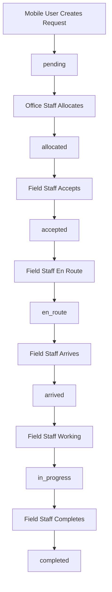

# 🚨 Panic Request Workflow Documentation

**Version:** 1.0  
**Last Updated:** 2025-09-19  
**System:** Panic Emergency Response System

---

## 📋 Overview

This document outlines the complete end-to-end workflow for panic requests in the emergency response system, from mobile user initiation to field staff resolution. The workflow ensures accountability, real-time tracking, and proper escalation through multiple stakeholders.

## 🎯 Stakeholders

| Role | Responsibility | Access Level |
|------|---------------|--------------|
| **Mobile User** | Creates panic requests | Mobile app only |
| **Office Staff** | Views & allocates requests | Firm dashboard |
| **Field Staff** | Responds to assigned requests | Mobile app + field operations |
| **Team Leaders** | Manages field team assignments | Mobile app + team management |
| **Firm Admin** | Oversees all firm operations | Full system access |

---

## 🔄 Complete Workflow Process

### **Step 1: 📱 Mobile User Creates Panic Request**

**Endpoint:** `POST /api/v1/emergency/request`

**Process:**
1. User presses panic button in mobile app
2. App automatically collects GPS coordinates
3. User selects emergency service type
4. Optional description can be added
5. Request submitted with mobile attestation

**Example Request Payload:**
```json
{
  "requester_phone": "+27123456789",
  "group_id": "a533231f-80a7-4147-ad4a-fffcadb2bac9", 
  "service_type": "security",
  "latitude": -26.1076,
  "longitude": 28.0567,
  "address": "123 Oak Street, Sandton",
  "description": "Suspicious activity near entrance"
}
```

**System Validations:**
- ✅ Phone number authorization
- ✅ Rate limiting protection  
- ✅ Subscription status validation
- ✅ Coverage area validation
- ✅ Duplicate request detection

**Initial Status:** `pending`

---

### **Step 2: 🏢 Firm Office Views Pending Requests**

**Endpoint:** `GET /api/v1/emergency/firm/{firm_id}/pending`

**Authorization Required:**
```bash
Authorization: Bearer {jwt_token}
# Token must include firm_id and appropriate permissions
```

**Process:**
1. Office staff logs into dashboard
2. Views list of all pending panic requests for their firm
3. Sees request details including:
   - 📍 Location (GPS coordinates + address)
   - 🚨 Service type (security, ambulance, fire, towing)
   - ⏰ Request timestamp
   - 📝 User description
   - 📞 Requester phone number

**Response Structure:**
```json
{
  "requests": [
    {
      "id": "d0aa4d20-c0af-4619-9cc4-af33a93383fe",
      "group_name": "Smith Family",
      "service_type": "security", 
      "status": "pending",
      "latitude": -26.1076,
      "longitude": 28.0567,
      "address": "Emergency at Smith Family, security needed",
      "description": "Suspicious activity reported near main entrance",
      "created_at": "2025-09-19T14:43:24Z"
    }
  ],
  "total": 8,
  "limit": 50,
  "offset": 0
}
```

---

### **Step 3: 👩‍💼 Firm Allocates Request to Team/Provider**

**Endpoint:** `PUT /api/v1/emergency/{request_id}/allocate`

**Process:**
1. Office staff analyzes request details
2. Determines best response team or external service provider
3. Considers factors:
   - 📍 Proximity to incident location
   - 🚨 Service type requirements
   - 👥 Team availability
   - ⏱️ Response time capabilities

**Allocation Options:**

**Option A - Internal Team:**
```json
{
  "team_id": "550e8400-e29b-41d4-a716-446655440000",
  "notes": "Alpha team assigned - nearest to location"
}
```

**Option B - External Service Provider:**
```json
{
  "service_provider_id": "660f9500-f39c-42e5-a827-557766551001", 
  "notes": "Ambulance service required - medical emergency"
}
```

**Status Change:** `pending` → `allocated`

---

### **Step 4: 👨‍💼 Field Staff Views Team Assignments**

**Endpoint:** `GET /api/v1/emergency/teams/{team_id}/requests`

**Process:**
1. Field staff opens mobile/tablet app
2. App shows requests assigned to their team
3. Requests displayed by priority/timestamp
4. Each request shows:
   - 🎯 Incident location on map
   - 🚨 Emergency type and severity
   - 📋 Request details and description
   - ⏰ Time since request created
   - 📞 Contact information

**Query Parameters:**
```bash
GET /api/v1/emergency/teams/{team_id}/requests?status_filter=allocated&limit=20
```

---

### **Step 5: ✅ Field Staff Accepts Request**

**Endpoint:** `POST /api/v1/emergency/agent/requests/{request_id}/accept`

**Authorization:**
- Must be field agent or team leader
- Requires mobile attestation
- Must be assigned to relevant team

**Process:**
1. Field staff reviews request details
2. Confirms they can respond
3. Provides estimated arrival time
4. Submits acceptance

**Acceptance Payload:**
```json
{
  "estimated_arrival_minutes": 15
}
```

**What Happens:**
- ✅ Request status: `allocated` → `accepted`
- ⏰ `accepted_at` timestamp recorded
- 📱 Mobile user gets notification: "Help is coming - ETA 15 minutes"
- 🎯 GPS tracking begins for field staff location

**Status Change:** `allocated` → `accepted`

---

### **Step 6: 🚗 Real-Time Updates During Response**

**Endpoint:** `PUT /api/v1/emergency/requests/{request_id}/status`

**Status Progression:**
```
accepted → en_route → arrived → in_progress → completed
```

**Example Status Updates:**

**En Route:**
```json
{
  "status": "en_route",
  "message": "Team Alpha responding, ETA 8 minutes",
  "latitude": -26.1050,
  "longitude": 28.0580
}
```

**Arrived at Scene:**
```json
{
  "status": "arrived",
  "message": "On scene, assessing situation", 
  "latitude": -26.1076,
  "longitude": 28.0567
}
```

**In Progress:**
```json
{
  "status": "in_progress",
  "message": "Securing perimeter, situation under control",
  "latitude": -26.1076,
  "longitude": 28.0567
}
```

**Real-Time Tracking Features:**
- 📍 GPS coordinates with each status update
- ⏱️ Automatic timestamps for all status changes
- 📱 Push notifications to mobile user
- 🖥️ Live updates on office dashboard
- 📊 Response time metrics calculation

---

### **Step 7: ✅ Request Completion & Feedback**

**Endpoint:** `POST /api/v1/emergency/agent/requests/{request_id}/complete`

**Process:**
1. Field staff resolves the situation
2. Completes incident with feedback
3. Provides performance metrics
4. Documents outcome

**Completion Payload:**
```json
{
  "is_prank": false,
  "performance_rating": 5,
  "completion_notes": "Situation resolved successfully. Perimeter secured. No injuries reported."
}
```

**What Happens:**
- ✅ Status: `in_progress` → `completed`
- ⏰ `completed_at` timestamp recorded
- 📊 Performance data stored for analytics
- 📱 Mobile user gets completion notification
- 📋 Request archived for reporting

**Status Change:** `in_progress` → `completed`

---

## 📊 Status Flow Diagram



---

## 🗄️ Database Schema

### **Core Tables:**

**panic_requests**
```sql
CREATE TABLE panic_requests (
    id UUID PRIMARY KEY,
    group_id UUID REFERENCES user_groups(id),
    requester_phone VARCHAR(20),
    service_type VARCHAR(20), -- security, ambulance, fire, towing
    location GEOMETRY(POINT, 4326), -- PostGIS location
    address TEXT,
    description TEXT,
    status VARCHAR(20) DEFAULT 'pending',
    assigned_team_id UUID REFERENCES teams(id),
    assigned_service_provider_id UUID REFERENCES service_providers(id),
    accepted_at TIMESTAMP,
    arrived_at TIMESTAMP, 
    completed_at TIMESTAMP,
    created_at TIMESTAMP DEFAULT NOW(),
    updated_at TIMESTAMP DEFAULT NOW()
);
```

**request_status_updates**
```sql
CREATE TABLE request_status_updates (
    id UUID PRIMARY KEY,
    request_id UUID REFERENCES panic_requests(id),
    status VARCHAR(20),
    message TEXT,
    location GEOMETRY(POINT, 4326), -- Field staff location
    updated_by_id UUID REFERENCES firm_personnel(id),
    created_at TIMESTAMP DEFAULT NOW()
);
```

---

## 📱 Mobile App Integration

### **Mobile User App Features:**
- 🚨 One-tap panic button
- 📍 Automatic GPS location detection
- 🚨 Service type selection (security, ambulance, fire, towing)
- 📝 Optional description input
- 📬 Real-time status notifications
- ⏱️ ETA updates from field staff

### **Field Staff App Features:**
- 📋 Assignment dashboard
- 🎯 Interactive map with incident locations
- ✅ Accept/reject request functionality
- 📍 GPS tracking during response
- 📝 Status update interface
- 📊 Completion forms with feedback
- 📞 Direct communication channels

---

## 🔐 Security & Authorization

### **Authentication Requirements:**

| Endpoint | Auth Level | Required Permissions |
|----------|------------|---------------------|
| Mobile panic creation | Mobile attestation | Any verified mobile user |
| View firm requests | JWT token | `request:view`, firm personnel |
| Allocate requests | JWT token | `request:allocate`, supervisor+ |
| Accept requests | Mobile attestation + JWT | Field agent, team leader |
| Update status | Mobile attestation + JWT | Field agent, team leader |
| Complete requests | Mobile attestation + JWT | Field agent, team leader |

### **Authorization Levels:**
- **Mobile User:** Can create requests only
- **Firm Staff:** Can view firm requests
- **Firm Supervisor:** Can allocate requests  
- **Field Agent:** Can accept/update assigned requests
- **Team Leader:** Full field operations access
- **Firm Admin:** Complete firm oversight

---

## 📈 Performance Metrics

### **Tracked Metrics:**
- ⏱️ **Response Time:** Request creation → acceptance
- 🚗 **Travel Time:** Acceptance → arrival  
- 🎯 **Resolution Time:** Arrival → completion
- 📊 **Performance Rating:** Field staff feedback (1-5 scale)
- 🚨 **Prank Detection:** False alarm identification
- 📍 **Coverage Analysis:** Geographic response patterns

### **SLA Targets:**
- **Urban Security:** < 10 minutes response
- **Ambulance:** < 8 minutes response  
- **Fire Emergency:** < 6 minutes response
- **Towing:** < 15 minutes response

---

## 🛠️ API Quick Reference

### **Core Endpoints:**

```bash
# Mobile user creates panic
POST /api/v1/emergency/request

# Office views pending requests  
GET /api/v1/emergency/firm/{firm_id}/pending

# Office allocates request
PUT /api/v1/emergency/{request_id}/allocate

# Field staff views assignments
GET /api/v1/emergency/teams/{team_id}/requests

# Field staff accepts request
POST /api/v1/emergency/agent/requests/{request_id}/accept

# Update request status
PUT /api/v1/emergency/requests/{request_id}/status

# Complete request
POST /api/v1/emergency/agent/requests/{request_id}/complete
```

---

## 🚨 Error Handling

### **Common Error Scenarios:**

| Error | Cause | Resolution |
|-------|-------|------------|
| `DUPLICATE_REQUEST` | Multiple requests from same user | Rate limiting active |
| `SUBSCRIPTION_EXPIRED` | User subscription lapsed | Renew subscription |
| `COVERAGE_UNAVAILABLE` | Location outside service area | Contact support |
| `TEAM_UNAVAILABLE` | No teams available | Escalate to external provider |
| `REQUEST_EXPIRED` | Request too old | Create new request |

---

## 📞 Support Information

**Emergency Escalation:**
- If system is unavailable: Call direct emergency numbers
- Technical issues: Contact system administrator
- Service unavailable: Automatic fallback to external providers

**System Monitoring:**
- Real-time uptime monitoring
- Performance metric tracking  
- Automatic failover capabilities
- 24/7 system health monitoring

---

*This workflow ensures comprehensive emergency response with full accountability, real-time tracking, and proper escalation through all stakeholders in the panic response system.*